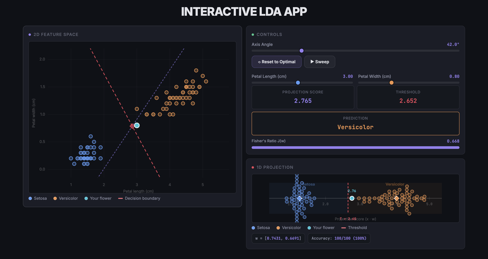

# Interactive LDA Explorer

An interactive, real-time visualization of **Fisher's Linear Discriminant Analysis (LDA)**. This web application allows you to manually explore how projecting 2D data onto a 1D axis affects class separation. By rotating the discriminant axis and adjusting test points, you can build an intuitive understanding of the math behind LDA.



## 🌟 Features

- **Interactive 2D Feature Space:** A dynamic scatter plot of the Iris dataset (Setosa vs. Versicolor) based on Petal Length and Petal Width.
- **Real-Time 1D Projection:** Watch the 2D points collapse onto a 1D number line based on the chosen projection axis, revealing how well the classes are separated.
- **Manual Axis Sweep:** Rotate the projection vector ($w$) manually using a slider or an automated sweep animation to see the effect on class separation.
- **Live Metrics:** Real-time calculation of:

  - Fisher's Ratio $J(w)$
  - Current Threshold
  - Classification Accuracy
  - Prediction for a custom test point
- **Optimal Reset:** Instantly snap to the mathematically optimal LDA vector computed via within-class and between-class scatter matrices.
- **Modern UI:** Built with a premium dark-mode aesthetic featuring glassmorphism, glowing accents, and smooth micro-animations.

## 🛠️ Technology Stack

- **HTML5 Canvas:** For high-performance, real-time rendering of the 2D scatter plot and 1D projection line.
- **Vanilla JavaScript:** All LDA math, vector projections, and UI logic are implemented from scratch in pure JS without external math libraries.
- **Vanilla CSS:** Custom styling using CSS variables, flexbox/grid layouts, and responsive design techniques.

## 🚀 How to Run

1. Clone the repository:
   ```bash
   git clone https://github.com/NotB3NZ/Interactive-LDA-Web-App.git
   ```
2. Navigate to the project directory:
   ```bash
   cd Interactive-LDA-Web-App
   ```
3. Open `index.html` in any modern web browser. No build steps or local servers are required!

## 🧠 Understanding the Math

Fisher's Linear Discriminant Analysis seeks to find a projection vector $w$ that maximizes the separation between multiple classes. The objective is to maximize **Fisher's Ratio** $J(w)$, which is defined as the ratio of between-class variance to within-class variance:

$$ J(w) = \frac{(m_1 - m_2)^2}{s_1^2 + s_2^2} $$

Where $m_i$ is the projected mean of class $i$, and $s_i^2$ is the variance of the projected samples in class $i$. In this app, you can manually adjust $w$ and watch $J(w)$ change in real time!

## 📝 License

This project is open-source and available under the MIT License.
